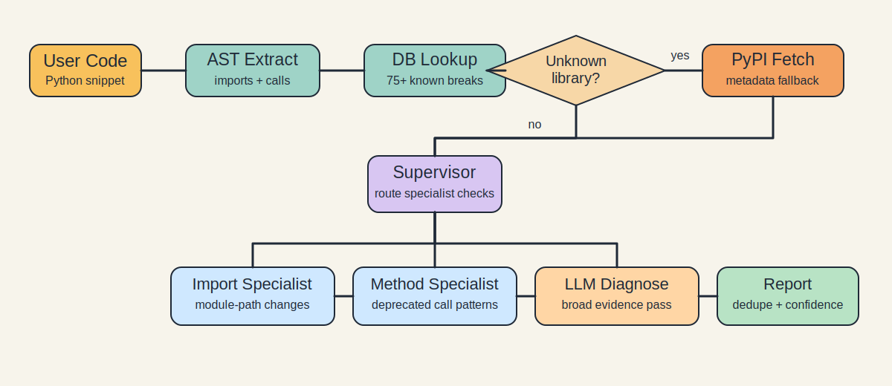

# llm-code-validator

Checks Python code snippets against a curated API breakage database and live PyPI metadata to catch outdated imports, removed methods, and obviously fake packages before runtime.


## Overview

This project was built around a simple failure mode: generated code often uses APIs that have moved or been removed. Examples from the dataset include `pinecone.init()`, `langchain.chat_models.ChatOpenAI`, and `pandas.DataFrame.append()`.

## Pipeline



1. Parse the input with `ast`
2. Extract imports, aliases, and attribute calls
3. Match calls against the local breakage database
4. Query PyPI for libraries outside the database
5. Route through the supervisor and specialist nodes
6. Merge findings into a typed validation report

The graph is implemented with LangGraph so the PyPI fetch and specialist passes can be skipped when they are not needed.

## Results

Latest saved benchmark from [`validation_dataset/results.json`](validation_dataset/results.json):

| Approach | Precision | Recall | Notes |
|---|---|---|---|
| Dictionary lookup (`tests/baseline.py`) | 86.7% | 80.2% | Exact string matching |
| `llm-code-validator` | 76.6% | 72.0% | AST + PyPI fallback + routed diagnosis |

The baseline still wins on raw benchmark score. The full validator adds corrected output, per-line explanations, and PyPI-backed handling for packages outside the local signature set.

## Limitations

- Import-name normalization is a lookup table, so uncommon import/distribution mismatches still need explicit entries.
- Repo-local import detection is heuristic and can still miss edge cases in larger codebases.
- Inputs are capped at 10,000 characters.
- Alias tracking is partial; complex object flows are not type-inferred.
- Libraries outside the curated set can be existence-checked on PyPI, but method-level validation is limited.
- When the OpenAI path is unavailable, the validator falls back to deterministic database/PyPI evidence and returns narrower explanations.

## Tech Stack

| Component | Technology |
|---|---|
| Agent graph | LangGraph 0.2.x |
| LLM | GPT-4o-mini |
| Backend | FastAPI |
| Validation schema | Pydantic v2 |
| Static parsing | Python `ast` |
| Package metadata | PyPI JSON API |
| Frontend | Vanilla HTML/JS |

## Running Locally

```bash
git clone https://github.com/mathew-felix/llm-code-validator
cd llm-code-validator
python -m venv venv
source venv/bin/activate
pip install -r requirements.txt
cp .env.example .env
uvicorn api.main:app --reload
```

Open `frontend/index.html` in a browser to use the demo UI.
