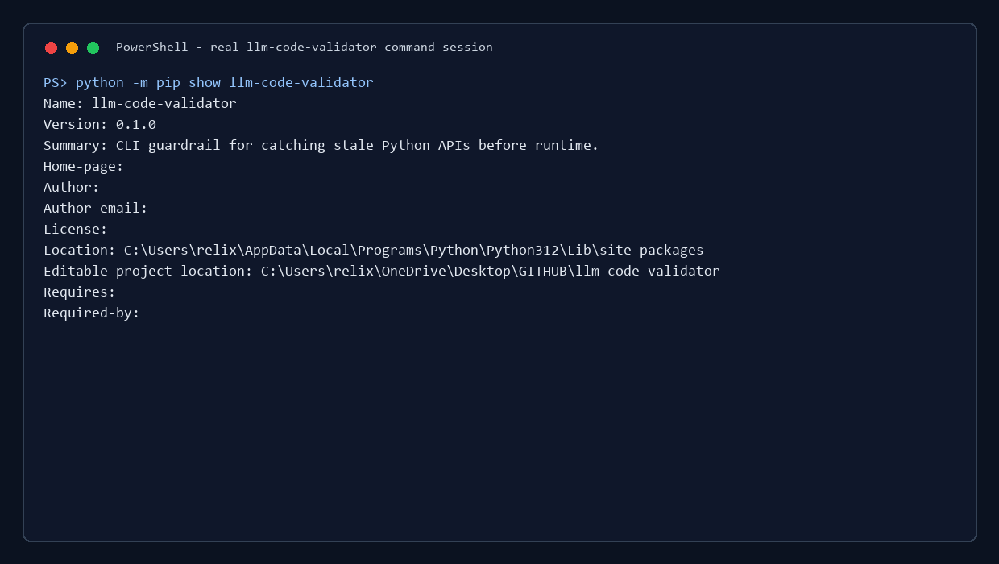

# llm-code-validator

Python CLI for checking dependency-heavy Python projects for stale or version-incompatible third-party API usage before commit or CI.

It parses Python files with `ast`, checks imports and calls against a maintained API-drift rule database, and reports issues before runtime.

Default checks are local-only. No OpenAI, Anthropic, or other LLM API key is required, and the tool does not make network calls in normal use.

PyPI: https://pypi.org/project/llm-code-validator/



## Install

```bash
pip install llm-code-validator
```

For local development:

```bash
git clone https://github.com/mathew-felix/llm-code-validator
cd llm-code-validator
pip install -e ".[dev]"
```

## Quick Use

```bash
llm-code-validator check file.py
llm-code-validator check src/
llm-code-validator check --staged
llm-code-validator check src/ --format json
llm-code-validator check src/ --format github
```

Exit codes:

- `0`: no diagnostics
- `1`: diagnostics found
- `2`: tool error

## Example

```python
from sqlalchemy.ext.declarative import declarative_base

Base = declarative_base()
```

```bash
llm-code-validator check app.py
```

```text
app.py:1 LCV001 warning sqlalchemy.declarative_base sqlalchemy.declarative_base is incompatible with sqlalchemy>=2.0.0
  fix: from sqlalchemy.orm import declarative_base
```

Preview or apply safe fixes:

```bash
llm-code-validator fix app.py
llm-code-validator fix app.py --write
```

## What It Checks

Current rule database:

- 68 API-drift rules
- 15 safe fixes
- Rules for OpenAI, Anthropic, LangChain, LangGraph, LlamaIndex, Pinecone, ChromaDB, FastAPI, Pydantic, pandas, NumPy, SQLAlchemy, Torch, Transformers, Keras, TensorFlow, SciPy, Weaviate, Qdrant, Motor, and CrewAI

Validate the rule database:

```bash
llm-code-validator validate-signatures
llm-code-validator validate-signatures --require-official-evidence
```

This checks source-level API migration patterns. It does not replace Ruff for linting, mypy for type checking, pip-audit for vulnerability checks, or Dependabot for dependency updates.

## Security Model

By default, `llm-code-validator` reads local Python files, parses them with Python's built-in `ast` module, and compares imports and calls with the bundled rule database. It does not send source code, dependency files, environment variables, or secrets to any external service.

## Rule Maintenance

Public rules are reviewed before release. New rules should be added to `data/library_signatures.json`, backed by official evidence such as migration guides, release notes, official docs, or maintainer discussions, and covered by a test or benchmark case.

The packaged PyPI wheel includes `llm_code_validator/library_signatures.json`, so users receive reviewed rule updates by upgrading the package:

```bash
pip install --upgrade llm-code-validator
```

Use `docs/rules.md` for the contribution workflow and `docs/release.md` for release verification.

## Limitations

- Detects known API-drift rules only.
- Does not detect every possible Python, dependency, security, or runtime issue.
- Does not prove full program correctness.
- Complex dynamic imports may be missed.
- Dependency checks depend on available project metadata.
- Suggested fixes require review before applying.
- External repository findings are treated as candidates until manually reviewed.

## Integrations

Pre-commit:

```yaml
repos:
  - repo: https://github.com/mathew-felix/llm-code-validator
    rev: v0.1.0
    hooks:
      - id: llm-code-validator
```

GitHub Actions:

```yaml
- run: pip install llm-code-validator
- run: llm-code-validator check . --format github
```

## Development

Run tests:

```bash
pytest -q
```

Run benchmarks:

```bash
python -m llm_code_validator.benchmark --dataset validation_dataset/cli_benchmark_cases.json
python -m llm_code_validator.benchmark --dataset validation_dataset/ai_stack_benchmark_cases.json
```

## More Details

- `docs/demo.md`: command walkthrough
- `docs/accuracy.md`: benchmark and external-review notes
- `docs/rules.md`: rule database notes
- `docs/security.md`: local-only behavior and policy controls
- `docs/release.md`: release steps
