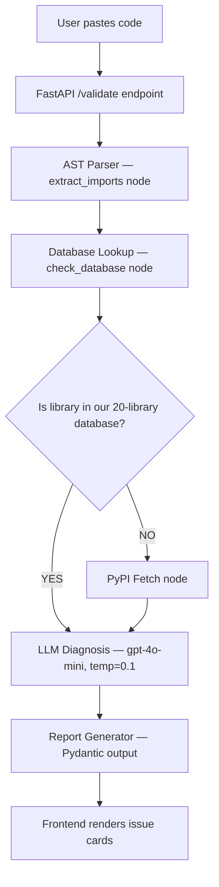

# llm-code-validator

Validates AI-generated Python code against real library APIs — catches hallucinated methods and deprecated imports before they waste your debugging time.


## The Problem

LLMs generate Python code using APIs that no longer exist. `pinecone.init()` was removed in v3. `langchain.chat_models` was restructured. `pandas.DataFrame.append()` was dropped in 2.0. Models trained before these changes don't know — and they generate broken code with complete confidence.

## How It Works



1. Paste AI-generated Python code into the web UI
2. The AST parser extracts all imports and method calls without executing the code
3. Imports are cross-referenced against a curated database of 75+ known breaking changes
4. If a library is outside the database, live PyPI metadata is fetched as fallback
5. A low-temperature GPT-4o-mini prompt diagnoses issues using only the database evidence — not its own memory
6. Issues are returned as structured JSON and rendered as fix cards in the UI

## Why LangGraph, Not a LangChain Chain

The validation workflow requires a **conditional branch**: if all imported libraries
exist in the local database, the PyPI network call is skipped entirely. If any library
is unknown, the PyPI fetch node runs before the LLM diagnosis.

A LangChain chain is sequential — every step runs every time, in order.
LangGraph's `StateGraph` with `add_conditional_edges` lets the graph inspect
the current state and route to a different node based on a condition.
This makes the agent faster (no unnecessary API calls) and more deterministic
(the routing logic is explicit code, not LLM reasoning).

## Validation Results

Evaluated against 50 real broken Python scripts sourced from Stack Overflow questions, GitHub issues, and LlamaIndex/LangChain migration guides. Test cases were collected externally — not written to match the database.

| Metric | Result |
|--------|--------|
| Test cases | 50 (external sources) |
| Libraries covered | 20 |
| Database entries | 75+ |
| Precision | 71.6% |
| Recall | 76.8% |

## Known Limitations

These are the documented cases where the validator does not work:

- **Aliased imports**: Deeply chained aliases are partially supported but sometimes missed if the alias tracking is broken or convoluted.
- **Star imports**: `from langchain import *` cannot be analyzed statically.
- **Dynamic imports**: `importlib.import_module('pandas')` is not detected.
- **Libraries outside the 20**: Falls back to PyPI metadata, which confirms the package exists but cannot validate specific method signatures, limiting its effectiveness for rare packages.
- **Method-level versus Import-level tracking**: Calls lacking an explicit library imported caller (`df.append()`) can be harder to attribute to a specific python package natively without type-checking.

## Tech Stack

| Component | Technology | Why |
|-----------|------------|-----|
| Agent framework | LangGraph 0.2.x | Conditional routing between nodes |
| LLM | GPT-4o-mini (temp=0.1) | Low temperature for deterministic diagnosis |
| Import parsing | Python `ast` module | Static analysis — no code execution |
| API validation | PyPI JSON API | Free, no auth, live package metadata |
| Backend | FastAPI | Async, fast, Pydantic-native |
| Output schema | Pydantic v2 | Strict typing guarantees on LLM output |
| Frontend | Vanilla HTML/JS | Zero build-tool dependencies |

## Running Locally

```bash
git clone https://github.com/mathew-felix/llm-code-validator
cd llm-code-validator
python -m venv venv && source venv/bin/activate
pip install -r requirements.txt
cp .env.example .env
uvicorn api.main:app --reload
```
Open `frontend/index.html` in your browser.